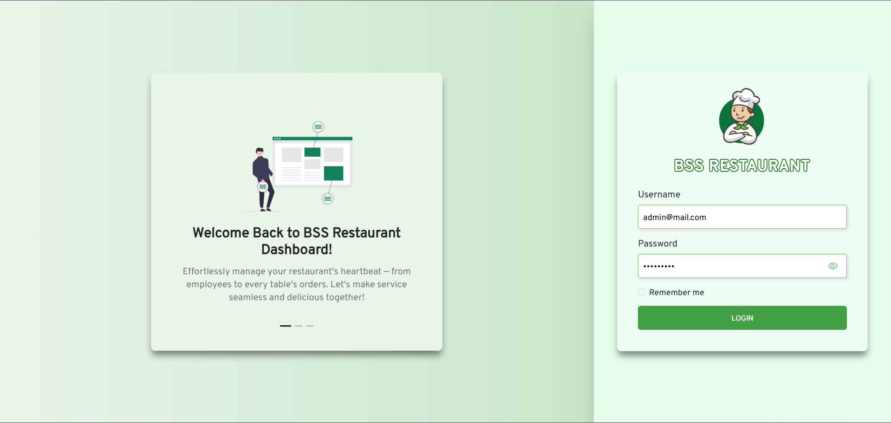
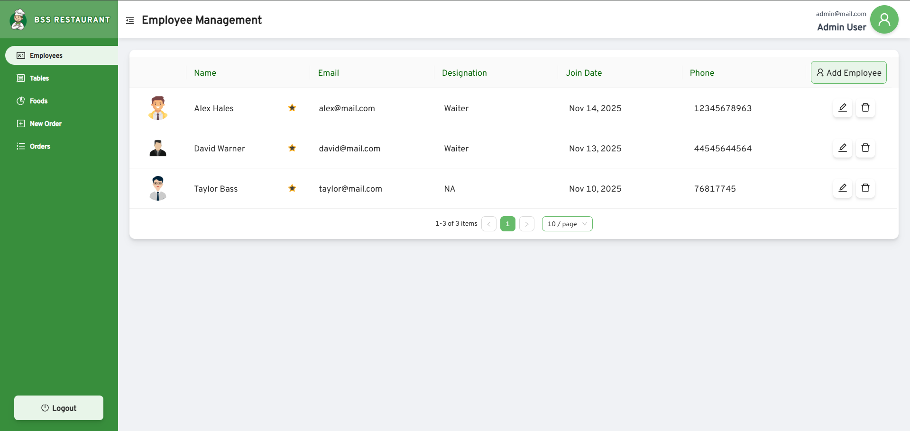
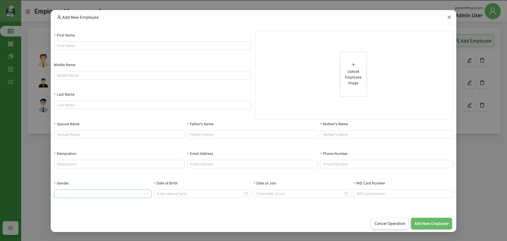
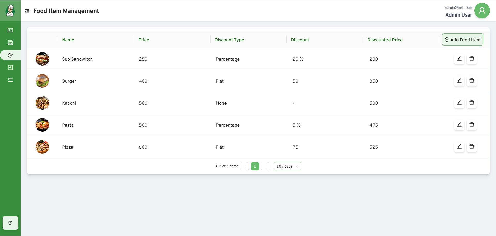
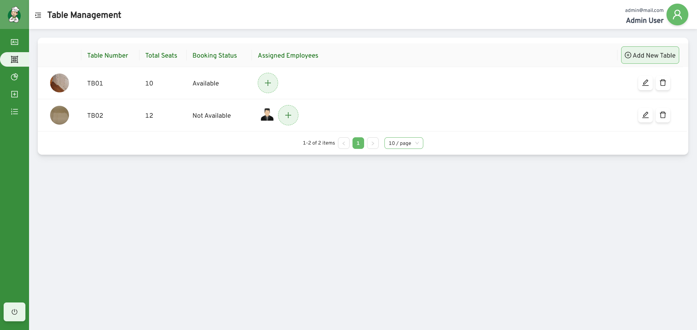
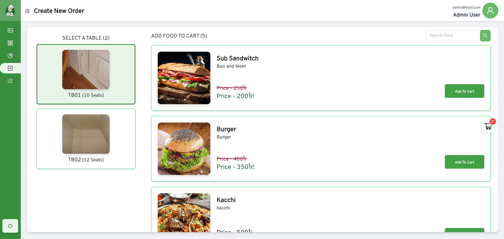
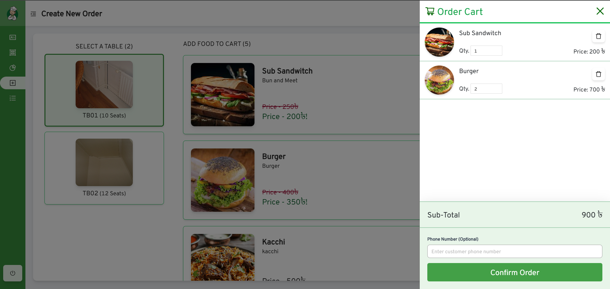
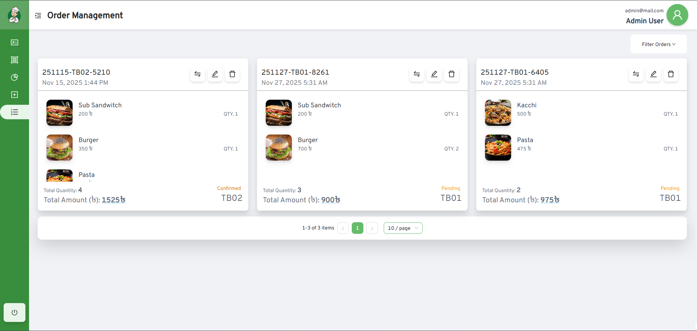
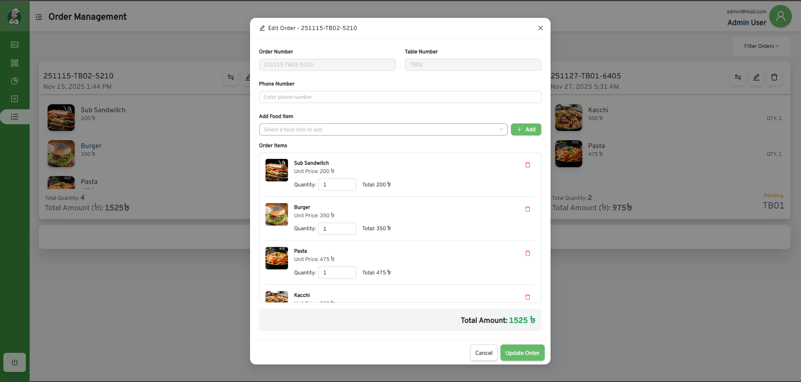
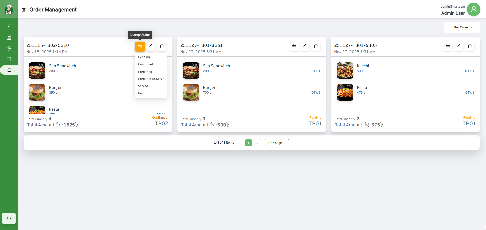

# BSS - Restaurant Management System
Restaurant Management System for Bangladesh Software Solution (BSS), built with Angular as the frontend framework and ASP.NET Core 9.0 as the backend framework.

 - **Live demo:** https://bss-rms.vercel.app/
 - **API Documentation:** http://bssrms.runasp.net/swagger/index.html
 - **Old API Documentation:** https://restaurantapi.bssoln.com/index.html

## Features
- User Authentication and Authorization
- Employee Management
- Food Management
- Order Processing
- Table Management

## Technologies Used
Frontend:
- Angular
- TypeScript
- HTML/CSS
- Bootstrap

Backend:
- ASP.NET Core 9.0
- Entity Framework Core

Database:
- SQL Server

## Setup Instructions
Instructions to set up the project locally can be found in the respective `README.md` files in the `bss-rms-api` and `bss-rms-spa` directories.

## UI Screenshots
### Login Page

### Employee Management

### Food Management

### Table Management

### New Order Management

### Order Management

